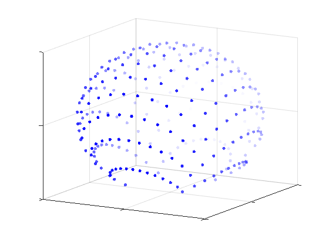

# Grassmannian Constellations Toolbox

A Matlab toolbox with implementations of different Grassmannian constellation designs for noncoherent communications.

Noncoherent communication schemes alleviate the drawbacks of training-based methods in scenarios dominated by fast fading or massive MIMO systems, where getting an accurate channel estimate would require pilots to occupy a disproportionate fraction of the communication resources. 

<i>Coherent versus noncoherent transmission schemes over a block-fading channel.</i>

  

In particular, Grassmannian signaling appears to be a promising approach to this problem when considering block-fading channels, which are likely to arise in many future networks. The basic idea is to encode the messages to be transmitted into different subspaces. When the coherence time of the channel, understood as the time that the channel remains approximately constant, is greater than the number of transmit antennas, the transmitted subspaces (represented by a semi-unitary matrix) are invariant to the MIMO channel, allowing the receiver to decode the received signal without the need of knowing the channel. This toolbox includes algorithms to obtain both structured and unstructured Grassmannian constellation designs and testcripts to evaluate their performance.

<i>Representation of Grass-Lattice constellation.</i>

  

Maintainer: [Diego Cuevas](https://scholar.google.es/citations?user=a05NsCAAAAAJ&hl=es), Universidad de Cantabria, Spain  

Contributors:  
- [Ignacio Santamaria](https://gtas.unican.es/people/nacho.htm), Universidad de Cantabria, Spain  
- [Carlos Beltran](https://personales.unican.es/beltranc/), Universidad de Cantabria, Spain
- [Javier Alvarez-Vizoso](https://scholar.google.com/citations?user=jEd_VlEAAAAJ&hl=es)    

Official web: https://github.com/diegocuevasfdez/grassbox 

Sample run
---
Figures generated by `StructuredConstellations/Testscript_Structured_M1.m`.

<i>SER curves of Grass-Lattice, Exp-Map and Cube-Split constellations.</i>

  

<i>BER curves of Grass-Lattice, Exp-Map and Cube-Split constellations.</i>

  

Directories included in the toolbox
---
`StructuredConstellations/` - testscripts for SER/BER evaluation of structured Grassmannian constellations

`StructuredConstellations/functions/` - structured Grassmannian constellation designs implementation

`UnstructuredConstellations/` - testscripts for SER evaluation of unstructured Grassmannian constellations

`UnstructuredConstellations/BestPackings` - numerically optimized Grassmannian packings with the minimum chordal distance achieved by method in [1]

`UnstructuredConstellations/functions` - algorithms implementation for designing unstructured Grassmannian constellations

Citing GRASSBOX
---

If you use this toolbox in your research please cite ["Advanced Grassmannian Constellation Designs for Noncoherent MIMO Communications"](https://hdl.handle.net/10902/34862):

	@phdthesis{CuevasThesis2024,
	      author = {Cuevas, Diego},
	      title = {Advanced {Grassmannian} Constellation Designs for Noncoherent {MIMO} Communications},
	      school = {Universidad de Cantabria, Spain},
	      year = {2024},
	      month = nov,
	      note = {Software available at \url{https://github.com/diegocuevasfdez/grassbox/}}
	    }
		
Included algorithms and designs
---
- GrassmannOpt-Chordal (GMO-Chordal) algorithm, as proposed in:
  
    [1] D. Cuevas, C. Beltran, I. Santamaria, V. Tucek and G. Peters, "A Fast Algorithm for Designing Grassmannian Constellations," 25th International ITG Workshop on Smart Antennas (WSA), French Riviera, France, Nov. 2021.
  
- GrassmannOpt-Coherence (GMO-Coherence) algorithm, as proposed in:
  
    [2] J. Alvarez-Vizoso, D. Cuevas, C. Beltran, I. Santamaria, V. Tucek and G. Peters, "Coherence-based Subspace Packings for MIMO Noncoherent Communications," 30th European Signal Processing Conference (EUSIPCO), Belgrade, Serbia, Aug. 2022.
  
- Grass-Lattice constellation design, as proposed in:
  
    [3] D. Cuevas, J. Alvarez-Vizoso, C. Beltran, I. Santamaria, V. Tucek and G. Peters, "A Measure Preserving Mapping for Structured Grassmannian Constellations in SIMO Channels,", IEEE Global Communications Conference (GLOBECOM), Rio de Janeiro, Brazil, Dec. 2022.
  
    [4] D. Cuevas, J. Alvarez-Vizoso, C. Beltran, I. Santamaria, V. Tucek and G. Peters, "Constellations on the Sphere with Efficient Encoding-Decoding for Noncoherent Communications," in IEEE Transactions on Wireless Communications, vol. 23, no. 3, pp. 1886-1898, Mar.          2024.
  
    [5] D. Cuevas, C. Beltran, M. Gutierrez, I. Santamaria and V. Tucek, "Structured Multi-Antenna Grassmannian Constellations for Noncoherent Communications," IEEE 13rd Sensor Array and Multichannel Signal Processing Workshop (SAM), Corvallis, OR, USA, Jul. 2024.
  
- Exp-Map constellation design, as proposed in:
  
    [6] I. Kammoun, A. M. Cipriano and J. -C. Belfiore, "Non-Coherent Codes over the Grassmannian," in IEEE Transactions on Wireless Communications, vol. 6, no. 10, pp. 3657-3667, Oct. 2007.
  
- Cube-Split constellation design, as proposed in:
  
    [7] K. -H. Ngo, A. Decurninge, M. Guillaud and S. Yang, "Cube-Split: A Structured Grassmannian Constellation for Non-Coherent SIMO Communications," in IEEE Transactions on Wireless Communications, vol. 19, no. 3, pp. 1948-1964, Mar. 2020.

License
---
This source code is released under the BSD 3-Clause License.
